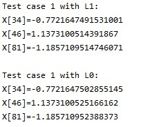
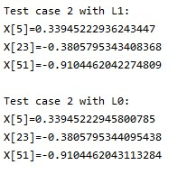

# Compressive Sensing

An example of compressive sensing  using l0 norm minimization (combinations exhaustive search) and l1 norm minimization. The data is given in the repository. 

## Results

## License
[MIT](https://choosealicense.com/licenses/mit/)